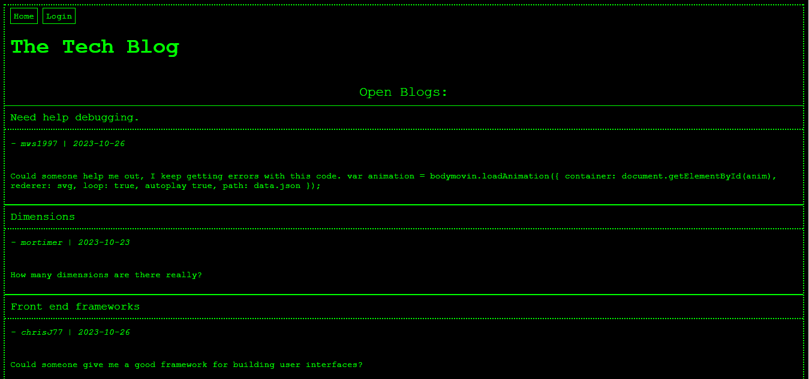

# PINK-DOLPHIN

## Description

The Tech Blog - This is a web page for users to connect and share ideas, opinons, or look for help with an issue.

Link to Site: https://pink-dolphin-01-f0fa109671a0.herokuapp.com/

## Installation

N/A

## Usage

Sign-up or Login to make posts or view the comments on other posts. 

Once logged in you can also make comments on the posts. 

Move to the dashboard tab at the top of the screen to view your blogs and make a new blog post. 

## License 
Visit [GPL License](https://www.gnu.org/licenses/gpl-3.0) for all information about this license

## How to Contribute

Signup to start chatting!

## Questions

For any questions, please contact me:

- GitHub: [imshocker](https://github.com/imshocker)